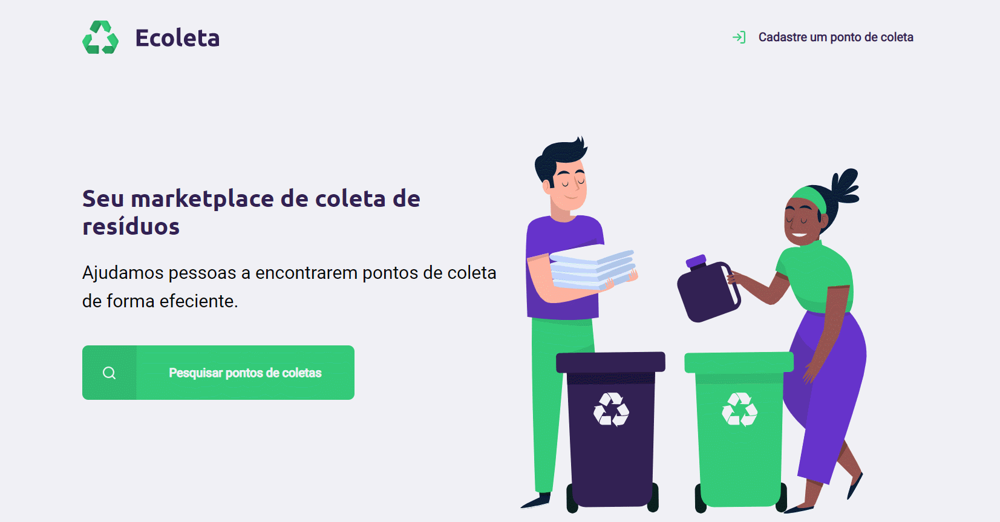

<h1 align="center">
  
</h1>

## 💻 Detalhes do projeto

O sistema foi desenvolvido no evento Next Level Week Starter (**NLW**) da empresa [Rocketseat](https://rocketseat.com.br/). O projeto que tem por objetivo disponibilizar um sistema onde as pessoas consigam encontrar e/ou cadastrar facilmente empresas que coletam resíduos para descarte nas cidades buscadas no sistema.

<h1 align="center">
    
</h1>

## :grey_question: Sobre esse evento

Next Level Week Starter (NLW) é um evento gratuito, com duração de uma semana, feitos para desenvolvedores iniciantes e experientes no mundo da programação, para que possam fazer networking, conhecer novas tecnologias (ou reforçar seus conhecimentos) com muito código e mão na massa.

## :rocket: Tecnologias utilizadas no projeto

As tecnologias utilizadas no projeto foram:

- [HTML5](https://developer.mozilla.org/en-US/docs/Web/Guide/HTML/HTML5)
- [CSS3](https://developer.mozilla.org/en-US/docs/Web/CSS)
- [JavaScript](https://developer.mozilla.org/en-US/docs/Web/JavaScript)
- [Node.js](https://nodejs.org/)
- [Express.js](https://expressjs.com/)
- [Nunjucks](https://mozilla.github.io/nunjucks/)
- [NPM](https://www.npmjs.com/)
- [Nodemon](https://nodemon.io/)
- [SQLite3](https://www.sqlite.org/version3.html)

- Obs: menção para api do [IBGE](https://servicodados.ibge.gov.br/api/docs/localidades?versao=1) que foi consumida para pesquisa das cidades e estados

## :package: Como utilizar o projeto

É preciso ter instalado no computador o [Git](https://git-scm.com) e o [Node.js](https://nodejs.org/) para clonar e executar o projeto. O projeto pode ser baixado com as linhas de comando ou no formato zip clicando no botão "Code" na opção "Download ZIP"

```bash

    # Clonar o repositório
    $ git clone https://github.com/alexvieirasj/nlw.git

    # Entrar no diretório baixado
    $ cd nlw

    # Instalar as dependências        
    $ npm install 

    # Iniciar o projeto
    $ npm start 
    
    # running on port 3000
```

## :memo: Licença

Este projeto está sob a MIT License. Acesso o arquivo [LICENSE](https://github.com/alexvieirasj/nlw/blob/master/LICENSE) para maiores detalhes.

